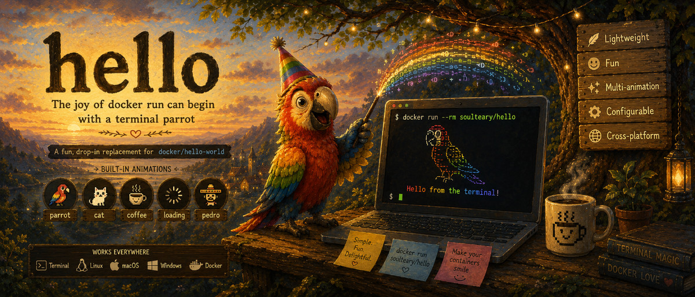

# hello

[](https://github.com/soulteary/hello/actions/workflows/test.yml)
[](https://github.com/soulteary/hello/actions/workflows/docker.yml)
[](.github/goreportcard-report.md)
[](go.mod)
[](LICENSE)



A tiny terminal animation and HTTP demo, built around the classic Party
Parrot. It is a playful alternative to `docker/hello-world` and a useful
backend for container, reverse-proxy, authentication-gateway and health-check
demos.

[中文文档](README.zh-CN.md)

## Quick start

Run the terminal animation:

```bash
docker run --rm -it soulteary/hello
```

The default animation loops until you press `Ctrl+C`. Use `-loops 1` when you
want a one-shot container:

```bash
docker run --rm soulteary/hello -loops 1
```

Images are published to both Docker Hub and GitHub Container Registry:

```bash
docker run --rm -it soulteary/hello
docker run --rm -it ghcr.io/soulteary/hello
```

## HTTP mode

Start the built-in server explicitly:

```bash
docker run --rm -p 8080:8080 ghcr.io/soulteary/hello -listen :8080
```

The root endpoint negotiates its representation from the request:

- `curl` and other non-browser clients receive `text/plain`: one randomly
  selected raw ASCII frame followed by useful, non-sensitive request
  diagnostics. Distinct frames are cached when the handler starts, so requests
  only perform an in-memory selection. The final line identifies the canonical
  project URL.
- Browsers receive a terminal-style HTML page. The page opens `/events` while
  preserving an external proxy path prefix, and the server continuously pushes
  animation frames using Server-Sent Events (SSE). JavaScript replaces the
  `<pre>` contents as each frame arrives; a text link to the project appears in
  the page footer.
- `?format=text` and `?format=html` override automatic detection. `plain` is an
  alias for `text`.

Try both representations:

```bash
curl http://127.0.0.1:8080/
curl -I http://127.0.0.1:8080/
curl http://127.0.0.1:8080/healthz

# Force HTML for inspection from a non-browser client
curl 'http://127.0.0.1:8080/?format=html'
```

Then open <http://127.0.0.1:8080/> in a browser to see the animated terminal.
If JavaScript or SSE is unavailable, the page still displays its embedded
first frame.

### HTTP endpoints

| Endpoint | Methods | Response |
| --- | --- | --- |
| `/` | `GET`, `HEAD` | Content-negotiated text frame or HTML terminal. |
| `/events` | `GET`, `HEAD` | SSE stream used by the browser page. |
| `/healthz` | `GET`, `HEAD` | `200 OK` with `ok`. |

Each `/events` message is named `frame` and contains JSON:

```text
event: frame
data: {"animation":"parrot","color":"#ff8787","frame":"...","index":0}
```

SSE is application-level server push over a normal long-lived HTTP response.
It is intentionally used instead of HTTP/2 resource push, which modern
browsers no longer support as a general page-delivery mechanism.

### HTTP options

Terminal flags are reused where they make sense:

```bash
# Serve the cat animation at 120 ms per frame, without rainbow colors
docker run --rm -p 8080:8080 ghcr.io/soulteary/hello \
  -listen :8080 -animation cat -delay 120 -mono
```

- `-animation` / `-a` selects the frame set used by terminal clients and the
  browser stream.
- `-delay` controls the SSE frame interval.
- `-mono` disables browser color cycling.
- `-loops` and `-list` cannot be combined with `-listen`.

The server has bounded request/header timeouts and graceful `SIGINT`/`SIGTERM`
shutdown. Streaming writes receive their own deadlines so an SSE connection is
not cut off by a short global response timeout. When a reverse proxy sits in
front of `/events`, disable response buffering for that route; hello also emits
`X-Accel-Buffering: no` for compatible proxies.

### Reflected request information

The plain-text response includes method, URL, host, hostname and version. A
blank line separates the greeting from the version, and the final line is
`Project: https://github.com/soulteary/hello`. Root responses also expose that
URL in the `Project` response header, including `HEAD` requests. The diagnostic
body reflects only this explicit allowlist of common routing/identity headers:

- `Forwarded`, `User-Agent`, `X-Real-IP`
- `X-Forwarded-For`, `X-Forwarded-Host`, `X-Forwarded-Method`,
  `X-Forwarded-Port`, `X-Forwarded-Prefix`, `X-Forwarded-Proto`,
  `X-Forwarded-URI`, `X-Forwarded-User`
- `X-Auth-Email`, `X-Auth-Groups`, `X-Auth-Name`, `X-Auth-Role`,
  `X-Auth-Scopes`, `X-Auth-User`

Credential-bearing or unrecognized headers are never reflected. This includes
`Authorization`, `Proxy-Authorization`, `Cookie`, `X-Auth-Token` and
`X-Forwarded-Access-Token`.

## Animations

| Name | Description |
| --- | --- |
| `parrot` | The classic Party Parrot. |
| `cat` | A bouncing cat. |
| `coffee` | A steaming cup of coffee. |
| `loading` | A simple loading spinner. |
| `pedro` | Pedro the raccoon. |

Pass the animation as a positional argument or with `-a` / `-animation`:

```bash
docker run --rm -it soulteary/hello cat
docker run --rm -it soulteary/hello -a coffee
docker run --rm soulteary/hello -list
```

See [the animation format reference](docs/animation-format.md) to add an
animation or understand its metadata and frame separators.

## Command-line reference

| Flag | Description | Default |
| --- | --- | --- |
| `-a`, `-animation` | Animation name; overrides the positional argument. | `""` |
| `-loops` | Number of terminal loops; `0` means infinite. | `0` |
| `-delay` | Frame interval in milliseconds; range `1`–`60000`. | `75` |
| `-mono` | Disable rainbow colors. | `false` |
| `-list` | List embedded animations and exit. | `false` |
| `-listen` | Listen for HTTP requests instead of running the terminal loop. | `""` |
| `-version` | Print the build version and exit. | `false` |
| `-h`, `-help` | Print usage and exit. | `false` |

Only one positional animation name is accepted. Unknown animations and invalid
flag combinations fail with a non-zero exit code and a diagnostic on stderr.

## Install a binary

Install from source with the Go version declared in [`go.mod`](go.mod):

```bash
go install github.com/soulteary/hello/cmd/hello@latest
```

Starting with `v2.0.0`, tagged releases include SHA-256 checksums and binaries
for:

- Linux: amd64, arm64
- macOS: amd64, arm64
- Windows: amd64, arm64

Release archives also include `LICENSE` and `NOTICE`. Container images run as a
non-root user on a distroless base and carry the same files under
`/usr/share/licenses/hello/`.

## Terminal compatibility

Terminal animation uses ANSI cursor and 256-color escape sequences. If your
terminal does not support them, use `-mono`; use `-loops 1` to avoid leaving an
unusable infinite animation running.

On Windows, prefer Windows Terminal or a recent PowerShell. Legacy `cmd.exe`
may not render the colors or cursor controls correctly.

## Development

The project is a dependency-free Go module organized into small internal
packages:

| Path | Responsibility |
| --- | --- |
| `cmd/hello` | Flag parsing and terminal/HTTP dispatch. |
| `internal/animation` | Embedded inventory and animation parser. |
| `internal/render` | ANSI terminal renderer. |
| `internal/cli` | Terminal playback loop and signal handling. |
| `internal/httpserver` | Content negotiation, HTML page, SSE and health checks. |

Common commands:

```bash
make help          # list targets
make build         # build ./hello with version metadata
make test          # run all tests with the race detector
make cover         # run tests and enforce the 90% statement-coverage floor
make lint          # run required golangci-lint checks
make vuln          # scan reachable code with govulncheck
make check         # run every required local quality gate, including tidy
make fuzz          # fuzz the animation parser for 30 seconds
make bench         # run renderer benchmarks
make docker        # build a local container image
```

Override the coverage floor when deliberately testing a stricter target:

```bash
make cover COVERAGE_MIN=95
```

CI verifies module tidiness, formatting, `go vet`, govulncheck,
golangci-lint, race tests and the coverage floor. CodeQL runs on pushes, pull
requests and a weekly schedule. Third-party GitHub Actions are pinned to full
commit SHAs.

See [CONTRIBUTING.md](.github/CONTRIBUTING.md) for the contribution workflow,
[SECURITY.md](.github/SECURITY.md) for private vulnerability reporting, and
[the v2 migration guide](docs/migration-v2.md) for HTTP compatibility details.
Maintainers should follow [the release guide](docs/releasing.md) before tagging
`v2.0.0` or a later release.

## Credits and license

This project is a heavily refactored fork of
[jmhobbs/terminal-parrot](https://github.com/jmhobbs/terminal-parrot) by
[John Hobbs](https://github.com/jmhobbs), originally released in 2016.

Released under the [MIT License](LICENSE):

- Copyright (c) 2016 John Hobbs — original work
- Copyright (c) 2026 soulteary — modifications and additions

Redistributions, including release archives and container images, must retain
`LICENSE` and `NOTICE`. The complete attribution list for bundled ASCII assets
is in [`NOTICE`](NOTICE).
